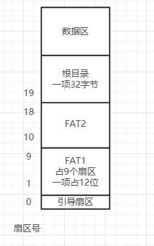

# AOS(Allen's OS)
AOS是一个可运行于i386的32位操作系统。
## 一些重要的前置知识
### 8086 16位数据总线 20地址总线
80386为了兼容8086的程序，有实模式和保护模式的区别。在实模式下，我们可以当作是在8086下编写代码。而在8086中，数据总线有16位，
地址总线却有20位，此时为了寻址到20位，有了这种形式，16位的段地址，16位的段内偏移量，在计算真实的物理地址时，需要段地址左移4位，
然后再加上偏移量。这一点是需要牢记的。另外8086中，段地址一般选取16字节对齐的地址，如：82260h，这样的话，段内偏移量就可以从0开始。
### NASM语法
使用NASM语法，在此特别提醒：
1. 在对某个内存单元进行读写时，要加上[]，例如：mov ax, [value]（不同于masm等于mov ax, value），
mov ax, [es:di]，没有mov OFFSET指令，nasm的mov ax, value == masm的mov ax, OFFSET value这有别于MASM和x86的汇编语法，
另外的一些区别参见NASM中文手册。
2. jmp label。在不指定cs和ip值时，认为是段内跳转。如，jmp 0x0:0x7c000，认为是段间转移。
### 段描述符与段描述符选择子
在保护模式下，要进行32位的寻址，那就意味着依靠原来的实模式下的16位 cs 和16位 ip 就行不同了，要寻求新的寻址方式。即保护模式下，利用段描述符和
段描述符选择子来寻址。简单地来想，32位的地址将会被保存在某个位置的内存中，当要跳转时，我们要当那个位置取出里面的值。这样的一个数据结构即为
GDT（全局描述符表），它由一个个的段描述符组成。而段描述符，顾名思义，它是用来描述一个段的信息的。描述符占64位，其中的32位便是用来表示一个段的
起始地址的。而GDT的内存地址又会存储在48位的GDTR寄存器中。

jmp 0x0008:0000102f是如何寻址的？

简单来看，0x0008会被置入cs，来作为一个段描述符选择子，0000102f会被置入eip。cpu会从GDTR中得到GDT位置，在利用cs可以定位到GDT的某一项，
即定位到某一段描述符，于是拿出其中的的32位段基址，与eip的值相加，得到目标地址。

0x0008这个段描述符选择子是如何索引的？

这16位 0000000000001_0_00，低3位是用来标识这个段的某些属性的，真正用来索引的是高13位，即，这里的索引号是1，在定位段描述符时，将 索引号*8，
得到该段描述符的起始地址。为什么要这样设计呢？其实完全可以把cs当作一个偏移量，然后加上GDT基址来得到段描述的呀？答案是，由于段描述占8字节，所以
偏移量是8的倍数，所以我们利用一下这低3位来记录点信息，最后可以通过先右移3位再左移3位获取到偏移量。

第一个为空描述符，在AMD架构中，这个空描述符在64位长模式下有另外的作用。
## 大概流程
AOS.img设置到机器的软盘控制器中，将boot.bin写入AOS.img的引导扇区。在AOS.img上建立FAT12文件系统，此时AOS.img的架构如下：

然后我们利用linux来将loader.bin放在文件系统的根目录下，具体操作为：
1. 在32位红帽中挂载AOS.img，如: mount /home/allen/AOS.img /mnt/floppy -o loop 。
2. 将文件loader.bin复制到 /mnt/floppy下。此时linux会帮我们写好一些信息，比如FAT项，根目录项，将loader.bin的内容写到数据区。
3. 在32位红帽中取消挂载AOS.img。

加电启动后，一旦BIOS发现了一个正确的引导扇区(以0xAA55结尾)，它就会将这个引导扇区的512B的内容加载到内存0x7c00处，这是由硬件决定的。
然后就的指令。跳转到内存0000:0x7c00处开始执行其上的指令。我们可以在boot.bin做一些必要操作(512字节的boot.bin能做的操作还是有限的)，
然后将loader.bin加载到内存当中，接着跳转到loader.bin所处的内存地址，执行其上的指令，就可以跨越512字节的限制了(所以我们可以把很多
指令放在loader.bin中)。

