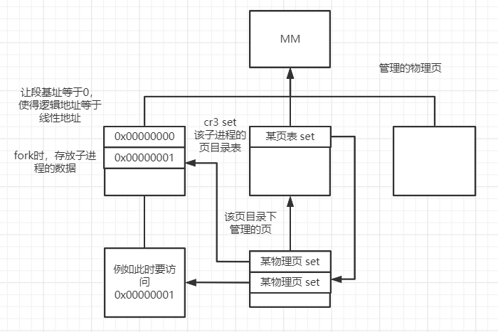

## 一些命名约定
1. 函数名统一使用小写和下划线，使用动词+名词，或动词或名词的形式命名，例如，print_string，意为字符串打印函数。
2. 宏定义，全局变量，静态变量统一使用大写和下划线，例如，DISPLAY_POSITION，意为字符串要打印到的地方。
3. 变量名统一使用小驼峰命名法，例如，isOdd，意为是否奇数。
4. 全局变量加上前缀 g_，如g_isOdd.
5. 静态变量加上前缀 s_.
6. 指针变量加上前缀 p_，双重指针 pp_.
7. 全局指针加上前缀 gp_.
8. 静态指针加上前缀 sp_.
9. 结构体最后以大驼峰命名暴露。如typedef struct{}Message;

## c语言对齐原则
### 在数据段中
1. char 偏移量必须为sizeof(char) 即1的倍数,可以任意地址开始存储
2. short 偏移量必须为sizeof(short) 即2的倍数,只能从0,2,4...等2的倍数的地址开始存储
3. int 偏移量必须为sizeof(int) 即4的倍数,只能从0,4,8...等4的倍数的地址开始存储
4. float 偏移量必须为sizeof(float) 即4的倍数,只能从0,4,8...等4的倍数的地址开始存储
5. double 偏移量必须为sizeof(double)即8的倍数,只能从0,8,16...等地址开始存储
### 在函数栈上
4字节对齐，返回值保存到eax中。

## 一些一定要注意的点
### 段名称的选取
在kernel.asm中，关于段名称的选取，如：section text与section .text是不同的，而我们应该选择后者。因为这不仅仅是一个名称而已，
.text是nasm默认采取的段名称，如果使用了 text ，那么nasm很可能将开头的某些代码默认其段名称为 .text(当然还要看，text所在的位置)，这样的话，
指令在文件中的排列状况，很可能会不符合我们的预期，而最终导致，在文件装载进内存后，cpu执行了错误的指令。以下指出二者在kernel.bin中反编译的结果：
#### test

#### .text

#### 在线反编译工具
https://onlinedisassembler.com

## 关于分页
这里的分页机制只是一个壳，即所以的进程使用同一个页目录及页表s，而得到的线性地址，其实也等于物理地址，没有做复杂的映射。不过，仍然是可以做的。
这里提供分页的思路。

1. 我们让所有的系统任务使用同一个页目录及页表s，在里面设置，使得逻辑地址等于线性地址等于物理地址。
2. mm按4k一页管理16MB以上的内存，用以放置origin fork出来的子进程，这里子进程的数据段可以访问全部空间，同时在fork的时候设置并记录好
子进程的页目录及页表s，其中让逻辑地址等于线性地址（同linux），让某一页表项指向存放进程数据的那一物理页。

## 子目录 lib
这是内核向外界提供的一些库函数

## 子目录 include
该目录下包含着整个系统会用到的一些信息，如.h文件。